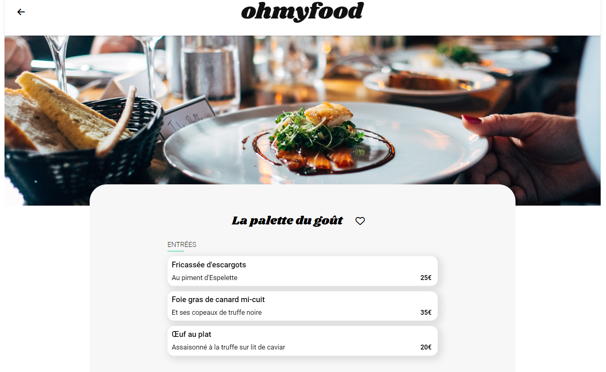

# Ohmyfood

## Presentation:

Ohmyfood is an application for meals booking in Parisian restaurants

Figma prototype is [here](https://www.figma.com/proto/t4449fzDnwGYmzuwQdu87V/Maquettes-Ohmyfood-(mobile-et-desktop)?node-id=25368-591&scaling=scale-down&page-id=0%3A1&starting-point-node-id=25368%3A591&show-proto-sidebar=1)

## Project constraints:

### 1. Mobile first
### 2. Css animations
### 3. No external frameworks

## Local setup

1. Clone and/or fork this repository.
2. Then start your Live Server